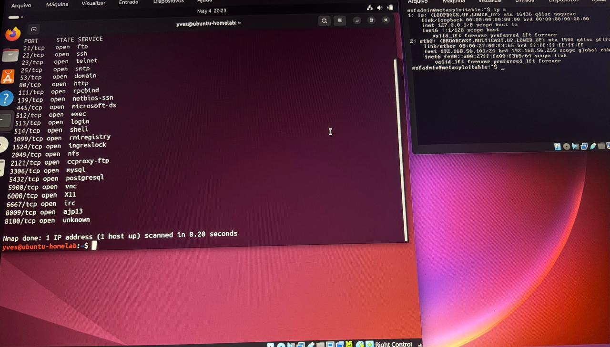

# metasploitable-initial-enumeration
Initial enumeration and SMB analysis in a controlled Metasploitable lab environment
# Metasploitable - Initial Enumeration and SMB Analysis
## Objective
Perform initial enumeration and identify potential vulnerabilities in a controlled lab environment using Metasploitable.
---
## Environment
- Attacker Machine: Ubuntu Linux
- Target Machine: Metasploitable 2
- Platform: Oracle VirtualBox
- Network: Host-Only
---
## Reconnaissance
Initial scan performed using Nmap:

nmap 192.168.56.101

